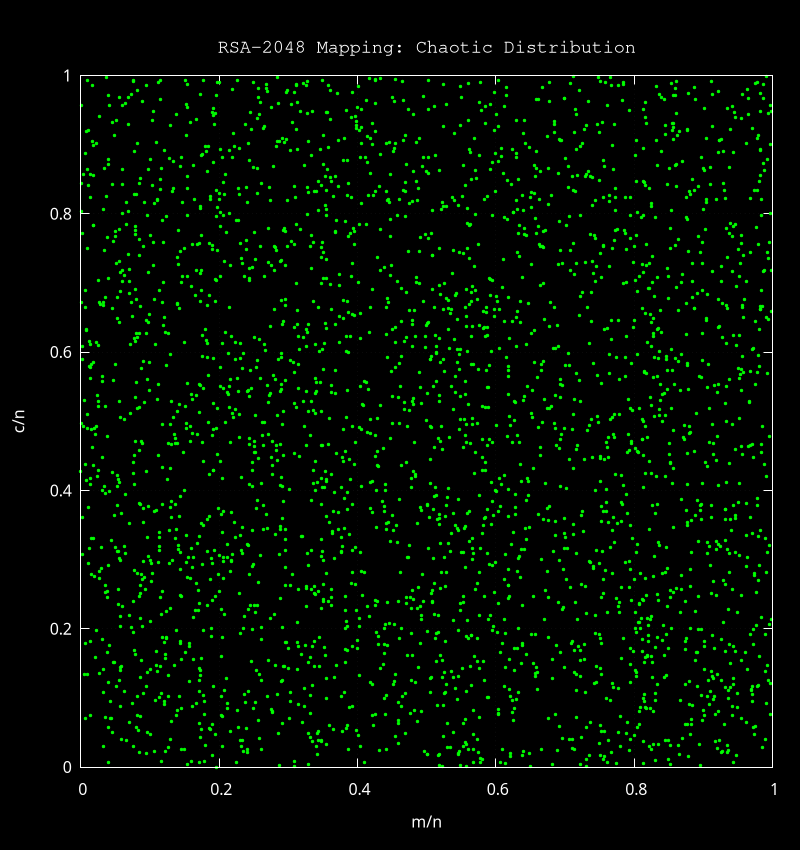

# RSA em Common Lisp

Implementação educacional e robusta do algoritmo RSA em Common Lisp.
O projeto evoluiu para suportar **RSA‑2048**, **assinatura com SHA‑256** e **padding conforme a RFC 8017**, com fatiamento automático de mensagens longas.

## Funcionalidades Atuais

- **Suporte a RSA‑2048**: utiliza fatores primos longos para gerar um módulo seguro de 2048 bits.
- **Assinaturas com SHA‑256**: hash completo em `hash.lisp`.
- **Padding RFC 8017**: PKCS#1 v1.5 (tipo 02 para cifra, tipo 01 para assinatura).
- **Cálculo dinâmico de bloco**: detecta automaticamente o tamanho útil do bloco com base no módulo.
- **Fatiamento automático (chunking)**: mensagens longas são divididas em blocos conforme o tamanho da chave.

## Estrutura do Projeto

- **`math.lisp`**: núcleo aritmético (exponenciação modular e Euclides estendido).
- **`rsa.lisp`**: lógica central do RSA e cálculo de `key-octet-length`.
- **`primes.lisp`**: constantes dos primos usados (RSA‑100 e RSA‑2048).
- **`padding.lisp`**: implementação do padding PKCS#1 v1.5.
- **`hash.lisp`**: SHA‑256 completo, usado na assinatura digital.
- **`messenger.lisp`**: camada de aplicação (conversão texto/bytes, cifra, decifra, assinatura e verificação).
- **`main.lisp`**: script principal demonstrando cifra, decifra e verificação.
- **`test.lisp`**: teste simples com primos pequenos.

## Matemática Aplicada

O sistema baseia-se nas transformações fundamentais do RSA:

- **Cifragem**: $c = m^e \pmod n$
- **Assinatura/Decifragem (via CRT)**:
  Em vez do cálculo direto $m = c^d \pmod n$, utilizamos os fatores primos para acelerar o processo:
  - $m_1 = c^{dP} \pmod p$
  - $m_2 = c^{dQ} \pmod q$
  - $h = qInv \cdot (m_1 - m_2) \pmod p$
  - $m = m_2 + h \cdot q$
- **Verificação**: $H(m) \equiv s^e \pmod n$

## Como Rodar

Certifique-se de ter o [SBCL](http://www.sbcl.org/) instalado.
Para rodar a simulação completa (RSA‑2048 + SHA‑256):

```bash
sbcl --script main.lisp
```

## Como Gerar Novos Primos

Você pode gerar primos grandes usando o OpenSSL:

```bash
openssl prime -generate -bits 1024
```

### Exemplo de uso no `primes.lisp`

Após gerar dois primos com o OpenSSL, substitua os valores:

```lisp
(defconstant +rsa-2048-p+
  1234567890123456789012345678901234567890...)

(defconstant +rsa-2048-q+
  9876543210987654321098765432109876543210...)
```

## Exemplo de Saída

O programa gera chaves RSA‑2048, assina a mensagem com SHA‑256, cifra em blocos de 256 bytes e valida a assinatura após a decifragem.

## Visualização: Mapeamento Caótico

Para demonstrar a segurança e a característica de permutação pseudo-aleatória do RSA-2048, o script `plot.lisp` gera uma visualização do espaço do módulo.



Este gráfico de dispersão (scatter plot) mostra 3.000 pontos normalizados $(m/n, c/n)$.

### Como gerar a imagem

O script utiliza o Gnuplot para renderizar os dados normalizados. Para gerar ou atualizar o gráfico, execute:

```bash
sbcl --script plot.lisp
```

## Licença

Este projeto é licenciado sob a Licença MIT. Veja o arquivo [LICENSE](LICENSE) para mais detalhes.
